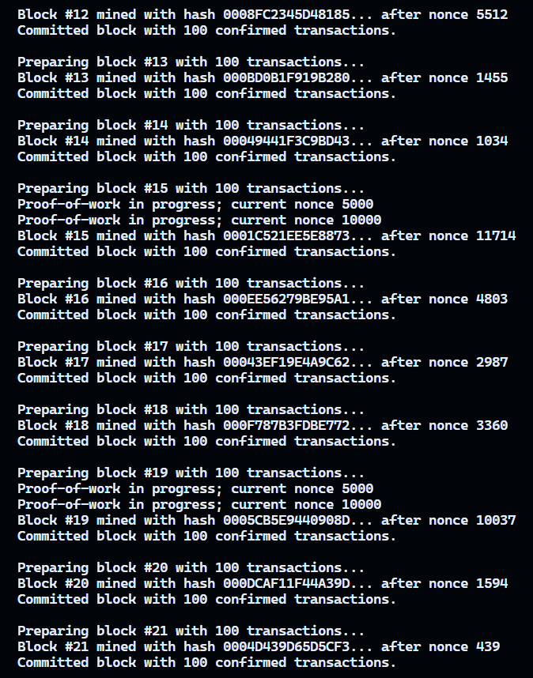

# Blockchain Lab v0.1

Trumpai: tai vieno kompiuterio "proof‑of‑work" žaidimų aikštelė. Sugeneruojame 1 000 naudotojų, 10 000 transakcijų, blokus po 100 transakcijų ir kasame iki kol baseine nelieka ką kasti. Viskas skirta suprasti mechaniką, ne kurti produkcinę grandinę.

## Greita apžvalga

* **Hashas**: mūsų PHA256 (iš 1 LD). Naudojamas ir transakcijų/šaknies skaičiavimui, ir PoW.
* **PoW tikslas**: bloko antraštės hash turi prasidėti **mažiausiai trimis nuliais**.
* **Duomenys**: 1 000 vartotojų su balansais `[100, 1_000_000]`, 10 000 transakcijų.
* **Bloko dydis**: ~100 patikrintų transakcijų viename bloke.
* **Saugojimas**: rezultatai JSON formatu `json/` kataloge.

## Turinys

- [Blockchain Lab v0.1](#blockchain-lab-v01)
  - [Greita apžvalga](#greita-apžvalga)
  - [Turinys](#turinys)
  - [Kaip paleisti](#kaip-paleisti)
  - [Ką pamatysite konsolėje](#ką-pamatysite-konsolėje)
    - [Konsolės pavyzdys](#konsolės-pavyzdys)
  - [Kaip veikia viduje](#kaip-veikia-viduje)
    - [Blokas](#blokas)
    - [Transakcijos (UTXO)](#transakcijos-utxo)
    - [Taisyklės](#taisyklės)
    - [Kasimas](#kasimas)
  - [Failų žemėlapis](#failų-žemėlapis)
  - [Nustatymai](#nustatymai)

## Kaip paleisti

1. Paleiskite iš repo šaknies:

   ```bash
   python main.py
   ```

2. Meniu pasirinkimai:

   * `1` – sugeneruoja `json/users_start.json` (1 000 vartotojų).
   * `2` – sugeneruoja `json/transactions.json` (10 000 transakcijų).
   * `3` – kasa blokus iki kol baseinas ištuštėja. Išvestis:

     * `json/blockchain.json` – blokų grandinė;
     * `json/users_end.json` – galutiniai balansai.

Jei kažko trūksta (pvz., nesugeneruoti vartotojai ar transakcijos), programa tai pasakys ir sustos.

## Ką pamatysite konsolėje

* Transakcijų rinkimo ir validavimo žingsnius.
* Kasančio nonco paiešką.
* Rasto bloko suvestinę: antraštę, transakcijų skaičių, hash.

### Konsolės pavyzdys



## Kaip veikia viduje

### Blokas

* **Antraštė**: previous_hash, timestamp, version, nonce, difficulty, tx_root.
* **Turinys**: 100 validžių transakcijų.

### Transakcijos (UTXO)

Generatorius kuria UTXO tipo pervedimus ir palaiko laikiną UTXO rinkinį, kad nuorodos būtų į *nesunaudotus* išėjimus. Mineris šiuos duomenis interpretuoja paskyrų lygmeniu, todėl tikrina tik siuntėjo ir gavėjo balansus.

**Forma** (`json/transactions.json`):

```json
{
  "transaction_id": "...",
  "inputs": ["<consumed_utxo_id>", "..."],
  "outputs": [
    {"UTXO_id": "...", "owner": "<receiver_public_key>", "amount": 2500},
    {"UTXO_id": "...", "owner": "<change_public_key>", "amount": 7500}
  ]
}
```

### Taisyklės

* Siuntėjas ir gavėjas turi egzistuoti vartotojų sąraše.
* Suma turi būti teigiama ir neviršyti siuntėjo balanso (naudojama „šešėlinė“ balansų kopija bloko rinkimo metu).
* `transaction_id` turi sutapti su `Hash(sender|receiver|amount)` (yra išlyga suderinamumui su ankstesniu formatu).

### Kasimas

1. Iš baseino paimame ~100 valid transakcijų.
2. Skaičiuojame antraštės hash su skirtingais `nonce` iki kol gauname `000...` pradžią.
3. Patvirtinus bloką:

    * transakcijas pašaliname iš baseino;
    * atnaujiname vartotojų balansus;
    * bloką pridedame prie `json/blockchain.json`.

## Failų žemėlapis

* `main.py` – paprastas meniu trijoms užduotims.
* `functions/block.py` – bloko struktūra ir šaknies skaičiavimas.
* `functions/blockchain.py` – validavimas, PoW, būsena, išsaugojimas.
* `functions/userGen.py`, `functions/transGen.py` – duomenų generatoriai.
* `functions/hash.py` – centralizuotas PHA256 kvietimas.
* `json/*.json` – įvestys ir išvestys.
* `console-output.png` – konsolės pavyzdys.

## Nustatymai

* **Difficulty**: `3`. Greita demonstracija, bet matomas PoW efektas.
* **Bloko dydis**: `~100` transakcijų. Keiskite, jei norite pamatyti kitą dinamiką.
